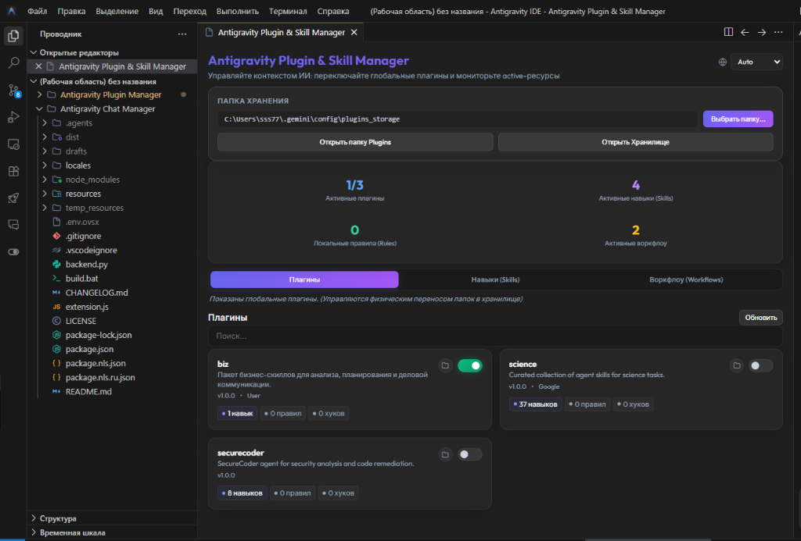
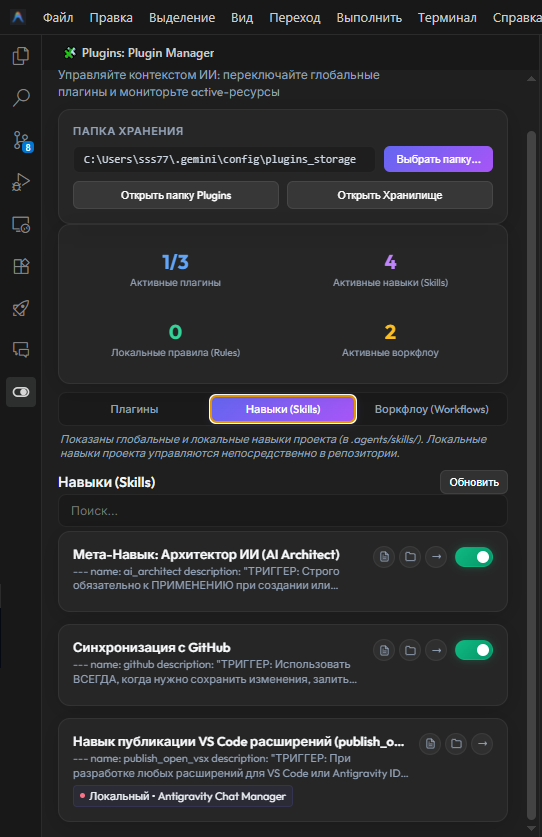
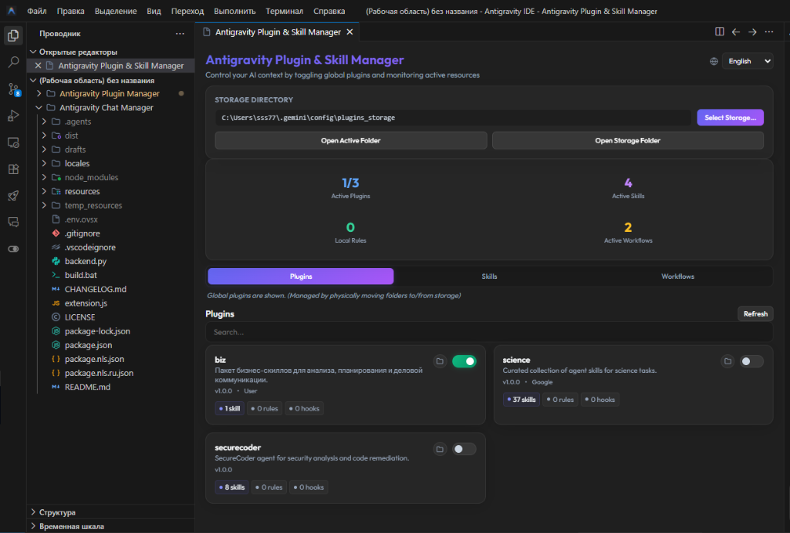
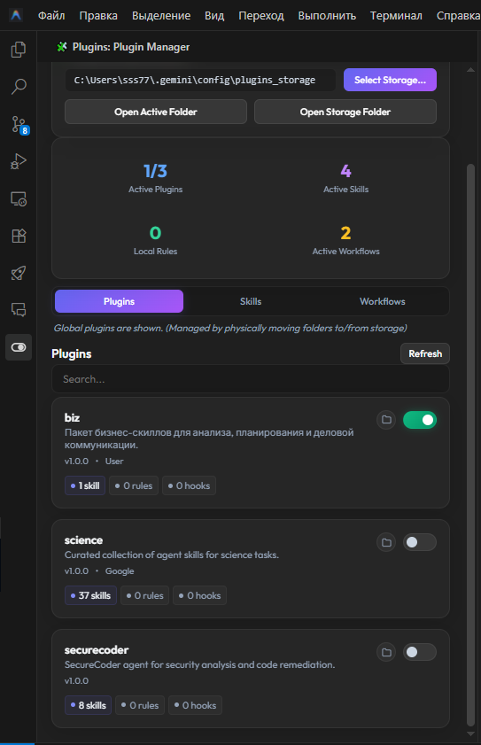

# Antigravity Plugin Manager

[Русский](#русский) | [English](#english)

> ⚠️ **Эксклюзивно для Antigravity IDE**: Данное расширение разработано специально для Antigravity IDE и не совместимо со стандартным VS Code.
> 
> **Exclusive for Antigravity IDE**: This extension is designed specifically for Antigravity IDE and is not compatible with standard VS Code.

---

## Русский

**Antigravity Plugin Manager** — это визуальный менеджер плагинов и анализатор активного окружения для **Antigravity IDE**. Он обеспечивает удобный поиск, редактирование, а также быстрое включение и выключение глобальных инструментов ИИ и навыков.

### Какие проблемы решает расширение?

1. **Неудобное управление плагинами и навыками в Antigravity IDE**:
   В Antigravity IDE по умолчанию отсутствует стандартный способ простого поиска, быстрого редактирования, а также удобного включения/выключения плагинов и навыков. Находить нужные инструменты и отключать их вручную в файловой системе сложно и неудобно. Менеджер предоставляет интуитивно понятную панель управления со списками и тумблерами.
2. **Отключение неиспользуемых инструментов для оптимизации контекста**:
   ИИ-агенты автоматически загружают все доступные правила, навыки и воркфлоу, что может перегружать рабочий контекст ненужными инструкциями. Отключение неиспользуемых плагинов и навыков позволяет оптимизировать загружаемый в ИИ контекст. Включение и выключение плагина осуществляется путем физического перемещения его папки в специальное хранилище (Storage) и обратно.

### Скриншоты

Панель управления (Webview):

Боковая панель (Sidebar):

### Установка и скачивание

Готовый пакет расширения `.vsix` можно скачать со страницы релизов:
👉 **[Последние релизы (VSIX)](https://github.com/MaximXR/Antigravity-Plugin-Manager/releases)**

После скачивания файла установите его в Antigravity IDE (меню *Extensions* -> кнопка *... (Views and More Actions)* -> *Install from VSIX...*).

> 💡 **Собственная сборка из исходников:**
> Вместо скачивания готового релиза вы можете скомпилировать расширение самостоятельно. Для этого запустите файл `build.bat` в корневом каталоге проекта — он автоматически проверит и установит необходимые зависимости, выполнит сборку и создаст актуальный `.vsix` файл в папке `dist/`.

### Основные возможности

- **Включение/выключение плагинов перемещением папок**: Физический перенос папок плагинов в хранилище для отключения их влияния на контекст.
- **Подсчет активного окружения**: Удобный мониторинг количества подключенных плагинов, навыков (Skills), локальных правил (Rules) и воркфлоу (Workflows).
- **Перемещение ресурсов**: Удобный перенос файлов навыков, правил и воркфлоу между глобальными папками, плагинами и локальными папками открытых рабочих областей (`.agents/`).
- **Защита от перезаписи и дублирования**: Проверка путей при переносе, исключение текущего расположения из списка назначения и защита от перезаписи файла самим собой.
- **Интеграция со статус-баром**: Кнопка в статус-баре с быстрым счетчиком активных плагинов и подробным всплывающим Markdown-списком.
- **Премиальный UI**: Современный интерфейс с эффектом Glassmorphism, микро-анимациями и автоматическим выбором языка (RU/EN).

### Системные требования и Совместимость

- Совместимость: Antigravity IDE (Windows, macOS, Linux).
- Требования для сборки: Node.js версии 18 или выше.

### От автора: сделано с душой ❤️
Привет! Этот плагин был создан не просто как утилита, а как попытка сделать ежедневную работу в Antigravity IDE чуточку приятнее, избавив от рутины ручного перекладывания файлов на диске. Я вложил много сил в проработку деталей — от плавных визуальных эффектов и Glassmorphism-дизайна до надежной рантайм-совместимости.

Если этот менеджер сэкономил вам время, принес пользу или просто порадовал глаз:
- **Поддержите проект звездой** 🌟 на нашем [GitHub Репозитории](https://github.com/MaximXR/Antigravity-Plugin-Manager) — это помогает другим разработчикам узнать о проекте.
- **Оставьте пару слов или отзыв** на [Open-VSX.org](https://open-vsx.org/extension/MaximXR/antigravity-plugin-manager). Любая обратная связь невероятно мотивирует писать чистый код и добавлять новые полезные функции.

Каждая звезда и каждый отзыв — это теплое подтверждение того, что эта работа действительно кому-то помогает. Спасибо вам! 😊

---

## English

**Antigravity Plugin Manager** is a visual plugin controller and active environment analyzer for **Antigravity IDE**. It provides a single-click interface to search, edit, toggle (enable/disable) global AI tools, and optimize active context parameters.

### What Problems Does It Solve?

1. **Inconvenient Plugin and Skill Management in Antigravity IDE**:
   By default, Antigravity IDE lacks a built-in interface to easily search, edit, enable, or disable global plugins and skills. Managing these items manually in the file system is difficult and slow. The manager solves this by providing a unified dashboard with quick toggles and tabs.
2. **Disabling Unused Tools to Optimize Context**:
   AI agents automatically read all active rules, skills, and workflows in the system. Disabling unused plugins and skills helps optimize the active context loaded by the AI. Enabling and disabling is achieved by physically moving directory folders into offline storage and back.

### Screenshots

Control Panel (Webview):

Sidebar:

### Installation & Download

You can download the compiled `.vsix` extension file from the GitHub releases page:
👉 **[Download Latest Releases (VSIX)](https://github.com/MaximXR/Antigravity-Plugin-Manager/releases)**

After downloading, install it in Antigravity IDE (via *Extensions* menu -> click *... (Views and More Actions)* -> *Install from VSIX...*).

> 💡 **Building from Source:**
> Instead of downloading a pre-built release, you can compile the extension yourself. Simply run the `build.bat` script in the project root directory — it will verify dependencies, package the extension, and place the output `.vsix` file in the `dist/` folder.

### Key Features

- **Plugin Toggling via Folder Movement**: Physically move folders to/from offline storage to disable them from the active AI context.
- **Environment Element Tallies**: Track active count totals for plugins, skills, local rules, and workflows.
- **Resource Relocation**: Relocate skills, rules, and workflows between global folders, plugins, and local workspaces (`.agents/` folder).
- **Protection & Safeguards**: Conflict resolution warnings, dynamic source location filtering in the target pick menu, and self-move safeguards.
- **Status Bar Indicator**: Quick active/total count button with a rich markdown hover tooltip.
- **Premium UI**: Sleek glassmorphism layout, micro-animations, and automatic bilingual detection (RU/EN).

### Prerequisites & Compatibility

- Compatibility: Antigravity IDE (Windows, macOS, Linux).
- Build Requirements: Node.js v18 or newer.

### From the Author: Crafted with Care ❤️
Hi there! This plugin was created not just as a basic utility, but as a sincere effort to make daily life in Antigravity IDE smoother, freeing you from manually rearranging directories. I spent a lot of time polishing the small details — from smooth animations and glassmorphism styling to solid safeguards that protect your local files.

If this plugin manager saved you some time, made your life easier, or simply looked neat:
- **Star this repository** 🌟 on our [GitHub Repository](https://github.com/MaximXR/Antigravity-Plugin-Manager) to help other developers discover this tool.
- **Write a brief review** on [Open-VSX.org](https://open-vsx.org/extension/MaximXR/antigravity-plugin-manager). Any feedback, kind words, or suggestions keep me highly motivated to improve the code and build new features.

Every star and review is a warm confirmation that this hard work makes a real difference. Thank you for your support! 😊
