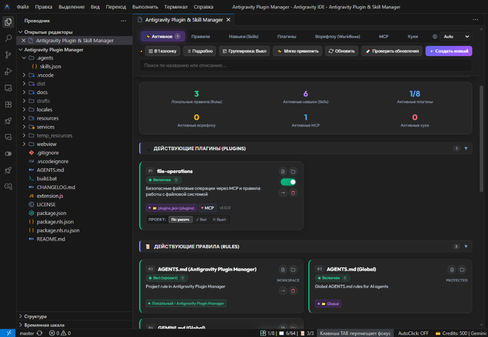
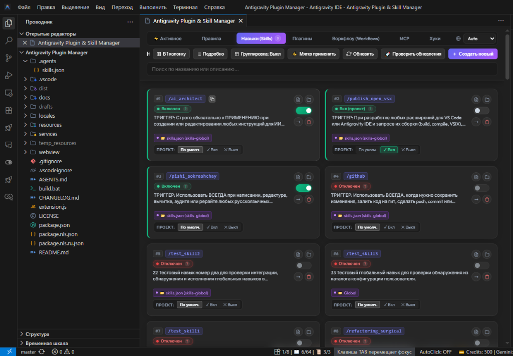
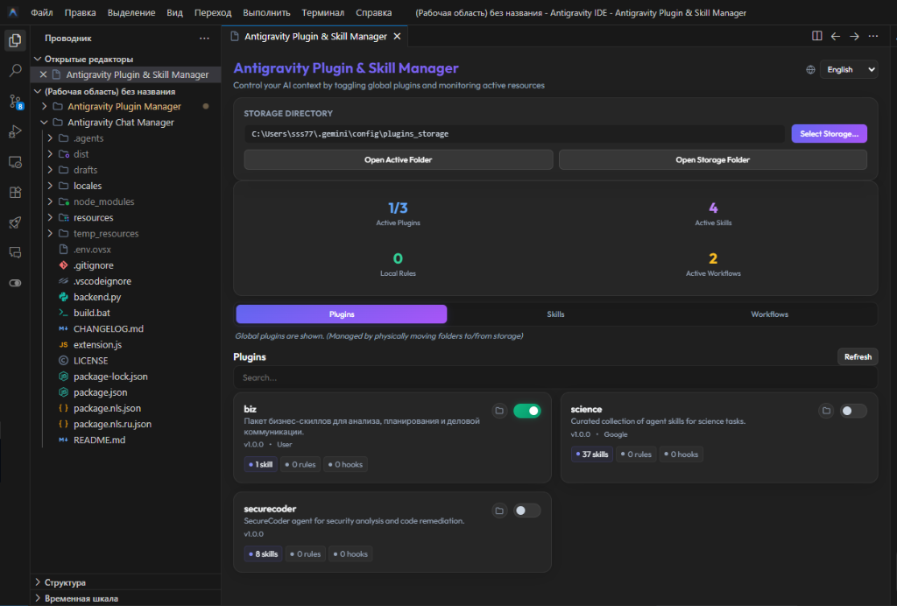

# Antigravity Plugin Manager
### AI Skill & Plugin Manager for IDE & Desktop

[Русский](#русский) | [English](#english)

> ⚠️ **Эксклюзивно для экосистемы Google Antigravity**: Разработано специально для **Antigravity IDE** и **Antigravity 2.0 (Desktop / CLI)**. Не предназначено для обычного VS Code.
> 
> **Exclusive to the Google Antigravity ecosystem**: Built specifically for **Antigravity IDE** and **Antigravity 2.0 (Desktop / CLI)**. Not intended for vanilla VS Code.

---

## Русский

**Antigravity Plugin Manager** (также известный как **AI Skill & Plugin Manager**) — графическая панель управления плагинами, навыками, правилами и MCP-серверами для **Antigravity IDE** и **Antigravity 2.0 (Desktop / CLI)**.

Доступен в двух удобных форматах:
1. **Встроенное расширение для Antigravity IDE:** панель управления прямо в Activity Bar редактора с тумблерами, мягким перезапуском сервера (Soft Apply) и счетчиком в статус-баре.
2. **Автономное приложение AI Skill & Plugin Manager Desktop:** независимая настольная программа для пользователей обычного **Antigravity 2.0 (Desktop)** и консоли **Antigravity CLI (`agy`)**. Работает автономно без запущенного редактора, сворачивается в системный трей и позволяет переключать контекст между любыми проектами на лету.

👉 **[Скачать расширение (.vsix) или Desktop-приложение (.exe / .zip)](https://github.com/MaximXR/Antigravity-Plugin-Manager/releases)** • Портативно и без установки • Бесплатно и с открытым исходным кодом

---

### Какую проблему решает менеджер

В Antigravity нет встроенного интерфейса для управления кастомизациями. На практике это создает три серьезные проблемы:

1. **Слепая зона окружения (Черный ящик)**  
   В IDE не видно, какие инструкции фактически загружены в модель прямо сейчас. Если агент начинает путаться, спорить или вызывать неподходящие инструменты, невозможно быстро понять причину: виноват забытый глобальный навык, конфликт инструкций или чужой плагин.

2. **Рутина в скрытых системных папках**  
   Чтобы включить, выключить или проверить плагин, приходится сворачивать редактор, открывать Проводник, искать скрытую директорию `%USERPROFILE%\.gemini` (или `~/.gemini`) и вручную редактировать `config.json`, `plugin.json` или `skills.json`. Это отнимает время, сбивает фокус и несет постоянный риск сломать синтаксис JSON.

3. **Раздутый контекст и путаница между проектами**  
   По умолчанию система подгружает все найденные правила и навыки одновременно. Инструкции для Python или баз данных попадают в системный промпт, даже когда вы верстаете фронтенд или пишете документацию. Контекст забивается лишним текстом, расходуются токены, а модели начинают путать правила разных проектов.

---

### Возможности

* 📊 **Дашборд «Активное»:** моментально показывает список и точное количество реально действующих плагинов, правил, навыков, воркфлоу, MCP-серверов и хуков. Плюс компактный счетчик в статус-баре IDE с подробной подсказкой.
* 🖥️ **Две среды работы (IDE Extension & Standalone Desktop):** используйте панель внутри IDE или автономное настольное приложение **AI Skill & Plugin Manager Desktop** с поддержкой системного трея и переключателем проектов Antigravity 2.0.
* 🔍 **Глубокий поиск правил (Rules Engine):** полностью сканирует все 4 варианта проектных служебных каталогов (`.agents/rules/`, `.agent/rules/`, `_agents/rules/`, `_agent/rules/`) с рекурсией по подпапкам (`rules/**/*.md`), находит корневые проектные правила `AGENTS.md` и `GEMINI.md`, а также правила, поставляемые внутри подключенных плагинов (`wordstat`, `file-operations` и др.).
* 🎛️ **Переключение в один клик:** включайте и выключайте плагины, навыки и MCP-серверы простыми тумблерами прямо в интерфейсе без ручной правки JSON.
* 🎯 **Настройки под проект (Project Overrides):** держите плагин выключенным глобально, но включайте его в 1 клик для конкретного репозитория (`[✓ Вкл]`). Или заглушите тяжелый инструмент в текущем проекте (`[✕ Выкл]`), не меняя общих настроек.
* ⚡ **Мягкое применение за 1–2 секунды (Soft Apply):** перезапускает только фоновый языковой сервер Antigravity. Окно IDE, открытые файлы и история чатов остаются на месте, а обновленный контекст применяется на лету.
* 📦 **Порядок и перенос ресурсов:** переносите навыки, правила и воркфлоу между глобальной папкой (`.gemini`), репозиториями проектов (`.agents/`) и плагинами со встроенной защитой от коллизий и перезаписи.
* 📁 **Мгновенный доступ к коду:** кнопки быстрого перехода открывают `SKILL.md`, `GEMINI.md` или `plugin.json` в редакторе, а папки плагинов — напрямую в Проводнике Windows.
* 🔄 **Обновление плагинов из GitHub:** проверяет наличие новых версий в репозиториях авторов и обновляет плагины в один клик с наглядным выводом процесса.
* 👁️ **Инспектор контекста (Live Context):** считывает сессии Antigravity и показывает, какие именно инструкции фактически ушли в системный промпт в последнем сообщении.

---

### Как это работает: нативная конфигурация без поломки Git

Antigravity штатно поддерживает управление активностью кастомизаций через файлы конфигураций, но не имеет встроенного графического интерфейса:
* `plugin.json` (`"disabled": true/false`) — официальный флаг активности в манифесте плагина.
* `config.json` (`"enabled": true/false`) — системный реестр активности для Antigravity 2.0 и CLI.
* `plugins.json` и `skills.json` — списки исключений (`"exclude"`) и точечного включения (`"include_only"`).

**Без перемещения и переименования папок:**
Каталоги плагинов и навыков всегда остаются на своих исходных местах. Менеджер управляет нативными JSON-настройками Antigravity: ваши Git-репозитории и сабмодули не ломаются, файлы не теряются, а языковой сервер мгновенно подхватывает изменения.

---

### Честные ограничения

* ⚠️ **Только для экосистемы Google Antigravity:** Расширение и настольное приложение разработаны специально для **Antigravity IDE** и **Antigravity 2.0 (Desktop / CLI)**. Для стандартного VS Code они не предназначены, так как там нет системы агентов и кастомизаций Antigravity.
* **Встроенные системные компоненты (`builtin`):** Системные навыки и конфигурации, поставляемые вместе с IDE, доступны только для чтения и защищены от случайного удаления.

---

### Установка и запуск

#### Вариант 1: Встроенное расширение для Antigravity IDE (.vsix)
1. Скачайте актуальный файл `.vsix` со страницы **[Релизов](https://github.com/MaximXR/Antigravity-Plugin-Manager/releases)**.
2. В Antigravity IDE откройте панель расширений (`Ctrl+Shift+X`).
3. Нажмите на меню с тремя точками `...` в правом верхнем углу панели ➔ **Install from VSIX...** и выберите скачанный файл.

#### Вариант 2: Автономное приложение AI Skill & Plugin Manager Desktop (Оба формата портативные!)

Выберите удобный формат со страницы **[Релизов](https://github.com/MaximXR/Antigravity-Plugin-Manager/releases)** (оба варианта не требуют установки и не засоряют систему):
* ⚡ **Архив `.zip` (Портативный, мгновенный запуск — Рекомендуется):** распакуйте в любую папку и запускайте. Поскольку файлы уже распакованы на диске, приложение стартует молниеносно.
* 📦 **Одиночный `.exe` (Портативный в один файл):** идеален, чтобы запустить в 1 клик без распаковки архивов или носить с собой на флешке. При старте тихо разворачивается во временную папку ОС (запуск занимает на 1–2 секунды дольше).

Приложение сразу готово к работе: оно автоматически определяет активный проект Antigravity 2.0 и сворачивается в трей по нажатию крестика.

> 💡 **Сборка из исходников:**
> Склонируйте репозиторий и запустите диспетчер сборки `build.bat` в корне:
> * `build.bat ide` (или `build-ide.bat`) — собрать расширение для IDE (`dist/*.vsix`)
> * `build.bat desktop` (или `build-desktop.bat`) — собрать десктопное приложение (`dist/*.exe`, `dist/*.zip` и распакованную папку `dist/win-unpacked/`)
> * `build.bat all` — собрать оба продукта одновременно

---

### Рекомендуемые расширения-компаньоны

* **[Antigravity Chat Manager](https://github.com/MaximXR/Antigravity-Chat-Manager)** — визуальный менеджер истории диалогов, поиск по сессиям и очистка диска от мусора ИИ в Antigravity.

---

### Обратная связь ❤️

Этот инструмент создавался, чтобы превратить настройку окружения Antigravity из утомительного копания в скрытых системных папках в быстрый и наглядный процесс. Если расширение помогает вам в работе:
* Поставьте звездочку 🌟 репозиторию на [GitHub](https://github.com/MaximXR/Antigravity-Plugin-Manager).
* Оставьте отзыв на [Open-VSX.org](https://open-vsx.org/extension/MaximXR/antigravity-plugin-manager).

---

## English

**Antigravity Plugin Manager** (also known as **AI Skill & Plugin Manager**) is a visual control panel for plugins, skills, rules, and MCP servers in **Antigravity IDE** and **Antigravity 2.0 (Desktop / CLI)**.

Available in two convenient form factors:
1. **Built-in Antigravity IDE Extension:** full control panel in the IDE Activity Bar with 1-click toggles, background Soft Apply, and a live context status bar counter.
2. **Standalone AI Skill & Plugin Manager Desktop:** independent Electron desktop app for users of standard **Antigravity 2.0 (Desktop)** and **Antigravity CLI (`agy`)**. Runs without VS Code, minimizes to the system tray, and enables seamless project switching on the fly.

👉 **[Download Extension (.vsix) or Desktop App (.exe / .zip)](https://github.com/MaximXR/Antigravity-Plugin-Manager/releases)** • Portable & Zero-Install • Free & Open Source

---

### The Problem It Solves

Antigravity does not provide a built-in UI for managing customizations. In practice, this creates three major bottlenecks:

1. **Zero Visibility (The Black Box Context)**  
   The IDE gives you no way to see what instructions are actually loaded into the model at any given moment. When an agent hallucinates, ignores instructions, or triggers unexpected tools, it is difficult to identify the culprit: a forgotten global skill, conflicting rules, or an outdated plugin.

2. **Tedious Manual Work in Hidden Folders**  
   To enable, disable, or inspect a plugin or skill, you have to leave your code, open File Explorer, navigate to the hidden `%USERPROFILE%\.gemini` (or `~/.gemini`) directory, and manually edit `config.json`, `plugin.json`, or `skills.json`. It is slow, disrupts your workflow, and risks breaking JSON syntax.

3. **Context Bloat & Cross-Project Clutter**  
   By default, Antigravity loads all discovered rules and skills simultaneously. Backend instructions for Python or databases stay loaded in memory even when you are working on a React frontend or editing documentation. The system prompt fills up with irrelevant instructions, wasting context capacity and confusing the model between different project rules.

---

### Key Capabilities

* 📊 **"Active" Dashboard:** Instantly displays exact counts and lists of active plugins, rules, skills, workflows, MCP servers, and hooks. Includes a compact status bar counter with rich hover tooltips.
* 🖥️ **Dual Form Factors (IDE Extension & Standalone Desktop):** Use the integrated IDE panel or run the standalone **AI Skill & Plugin Manager Desktop** app with system tray support and quick Antigravity 2.0 project switching.
* 🔍 **Comprehensive Rules Discovery Engine:** Fully scans all 4 Antigravity workspace customization directories (`.agents/rules/`, `.agent/rules/`, `_agents/rules/`, `_agent/rules/`) with recursive subdirectory support (`rules/**/*.md`), root project rules `AGENTS.md` and `GEMINI.md`, and rules bundled inside active plugins (`wordstat`, `file-operations`, etc.).
* 🎛️ **1-Click Toggles:** Enable or disable plugins, skills, and MCP servers with simple switches directly in the UI without touching raw JSON files.
* 🎯 **Project-Level Overrides:** Keep a plugin disabled globally, but enable it in one click for a specific repository (`[✓ On]`). Or suppress a heavy tool in one project (`[✕ Off]`) without altering your global setup.
* ⚡ **1–2 Second Soft Apply:** Restarts only the background Antigravity language server. Your IDE window, open files, and active chat sessions remain untouched while context refreshes on the fly.
* 📦 **Safe Resource Organization:** Move skills, rules, and workflows between global storage (`.gemini`), workspace projects (`.agents/`), and plugin packages with built-in safeguards against file overwrites.
* 📁 **Instant File & Folder Access:** Open `SKILL.md`, `GEMINI.md`, or `plugin.json` in the editor with one click, or jump directly to plugin folders in File Explorer.
* 🔄 **GitHub 1-Click Updates:** Checks author repositories for newer plugin versions and updates them in one click with a transparent process log.
* 👁️ **Live Context Inspector:** Inspects active IDE conversation records to reveal the exact instructions delivered to the model in the latest message turn.

---

### How It Works: Native Configuration Without Breaking Git

Antigravity natively supports managing customizations through configuration files, but provides no graphical interface to interact with them:
* `plugin.json` (`"disabled": true/false`) — official manifest toggle flag.
* `config.json` (`"enabled": true/false`) — system activation registry for Antigravity 2.0 and CLI.
* `plugins.json` & `skills.json` — `"exclude"` and `"include_only"` filtering arrays.

**No folder moving or renaming:**
Plugin and skill directories always remain in their original locations. The manager only modifies standard JSON configuration files: your Git repositories and submodules are never disturbed, files are never misplaced, and the Antigravity language server picks up changes cleanly.

---

### Honest Limitations

* ⚠️ **Antigravity Ecosystem Only:** Both the IDE extension and the standalone desktop app are designed exclusively for **Antigravity IDE** and **Antigravity 2.0 (Desktop / CLI)**. They do not work with vanilla VS Code, as it lacks Antigravity's agent customization engine.
* **Built-in System Components (`builtin`):** System skills and configurations bundled with the IDE are strictly read-only to prevent breaking the environment.

---

### Installation & Launch

#### Option 1: Built-in Extension for Antigravity IDE (.vsix)
1. Download the `.vsix` file from the **[Releases](https://github.com/MaximXR/Antigravity-Plugin-Manager/releases)** page.
2. In Antigravity IDE, open the Extensions panel (`Ctrl+Shift+X`).
3. Click the `...` menu (top-right corner of the Extensions panel) ➔ **Install from VSIX...** and select the downloaded file.

#### Option 2: Standalone AI Skill & Plugin Manager Desktop (Both Formats Are 100% Portable!)

Choose your preferred format from the **[Releases](https://github.com/MaximXR/Antigravity-Plugin-Manager/releases)** page (neither requires installation or admin rights):
* ⚡ **`.zip` Archive (Portable, Instant Startup — Recommended):** Unpack anywhere and launch. Because all binaries are already unpacked on disk, it opens instantly without delay.
* 📦 **Single `.exe` (Single-File Portable):** Perfect for USB flash drives or launching in 1 click without extracting. Quietly unpacks into the system temporary folder on startup (takes 1–2 seconds to initialize).

The app starts immediately, auto-detects your active Antigravity 2.0 project, and minimizes to the system tray upon closing.

> 💡 **Build from Source:**
> Clone the repository and run the unified `build.bat` script in the project root:
> * `build.bat ide` (or `build-ide.bat`) — build the IDE extension (`dist/*.vsix`)
> * `build.bat desktop` (or `build-desktop.bat`) — build the standalone Desktop app (`dist/*.exe`, `dist/*.zip`, and unpacked folder `dist/win-unpacked/`)
> * `build.bat all` — build both packages sequentially

---

### Recommended Companion Extensions

* **[Antigravity Chat Manager](https://github.com/MaximXR/Antigravity-Chat-Manager)** — visual conversation history manager, full-text search, and disk cleanup tool for Antigravity AI sessions.

---

### Feedback ❤️

Built to turn Antigravity environment configuration from a frustrating chore in hidden directories into a clean, transparent workflow. If this tool helps your development:
* Star the repository 🌟 on [GitHub](https://github.com/MaximXR/Antigravity-Plugin-Manager).
* Leave a review on [Open-VSX.org](https://open-vsx.org/extension/MaximXR/antigravity-plugin-manager).

